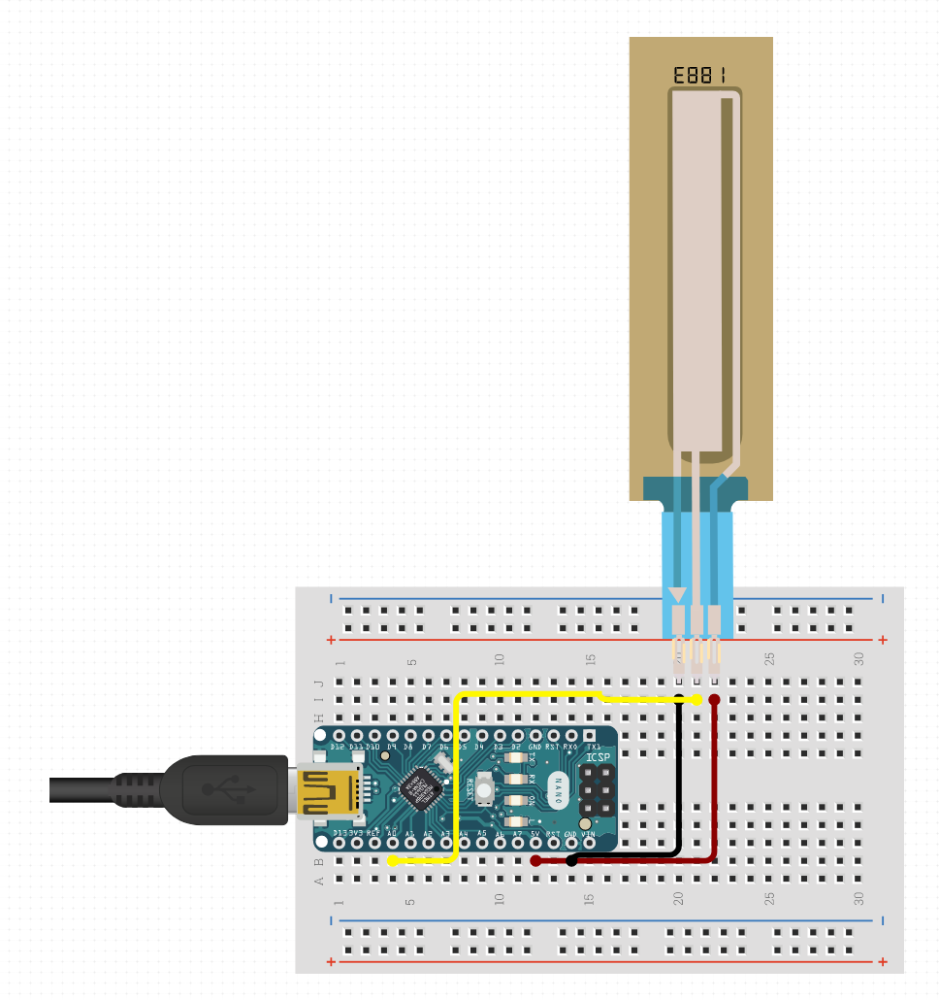

# LiquidLevelSensor

Code to run a Milone eTape as a water level sensor on an Arduino Nano.

Contains a calibration logic that can be triggered over serial port.

Sends current measurement (analog input translated via the calibration values) over serial in 500ms intervall.

